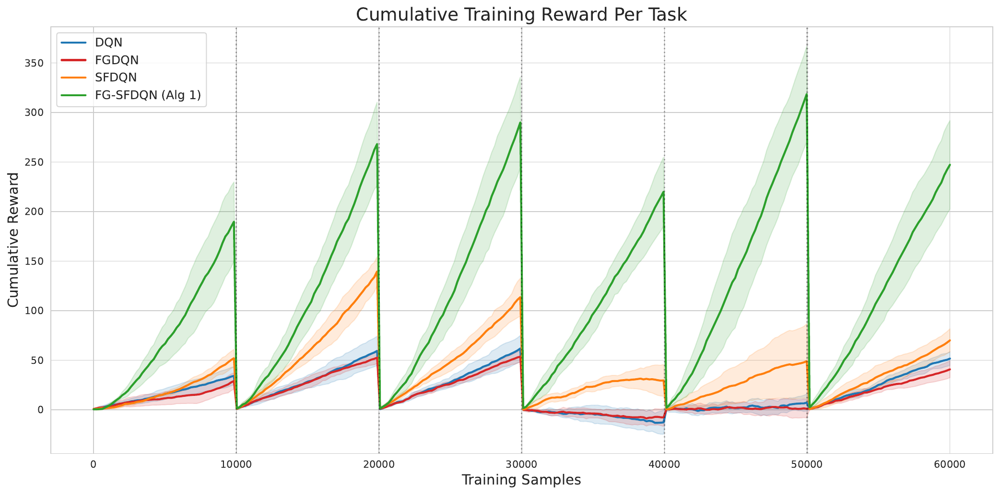
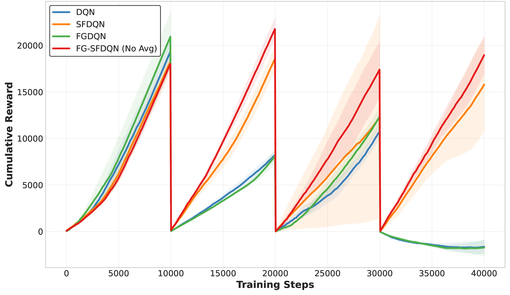
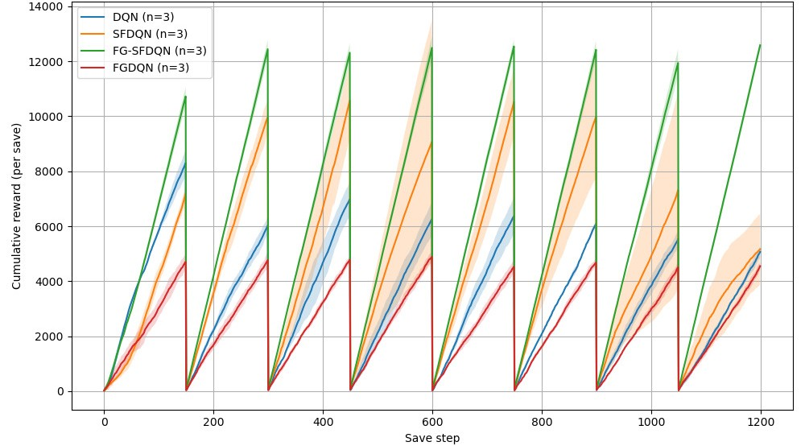
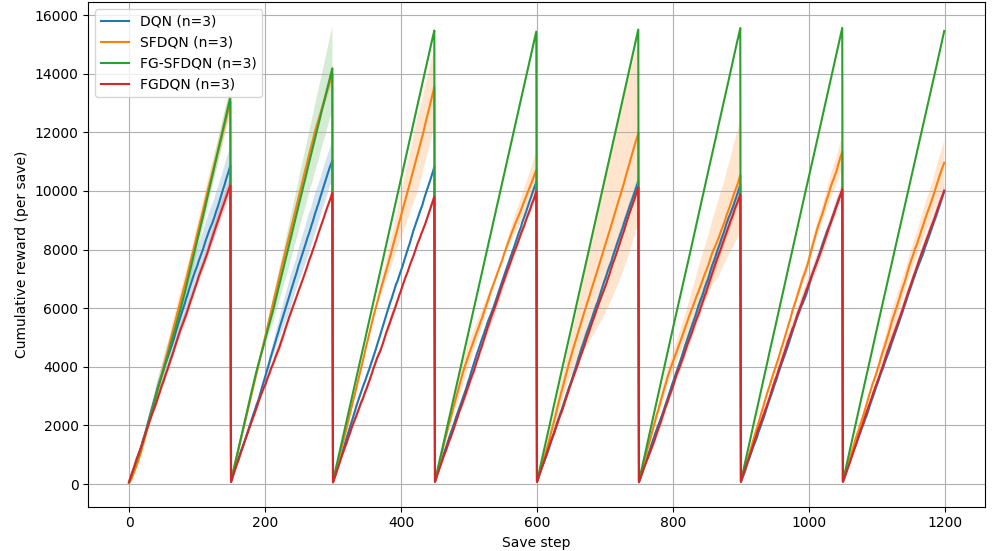
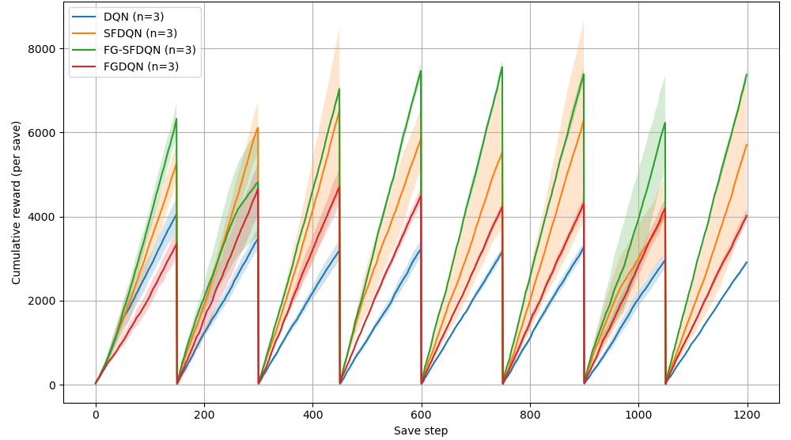
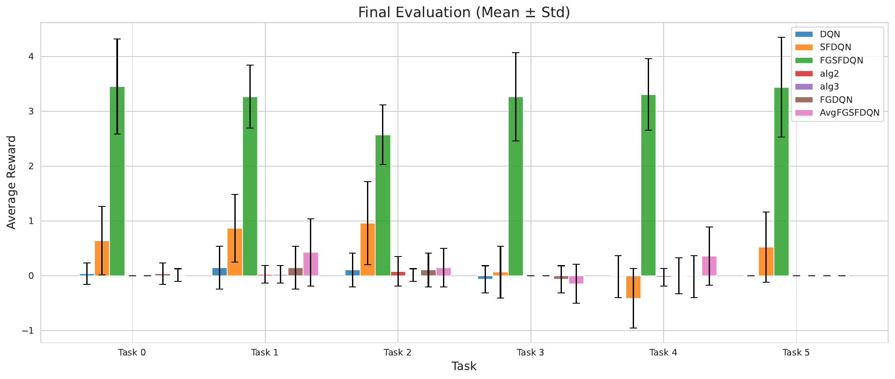
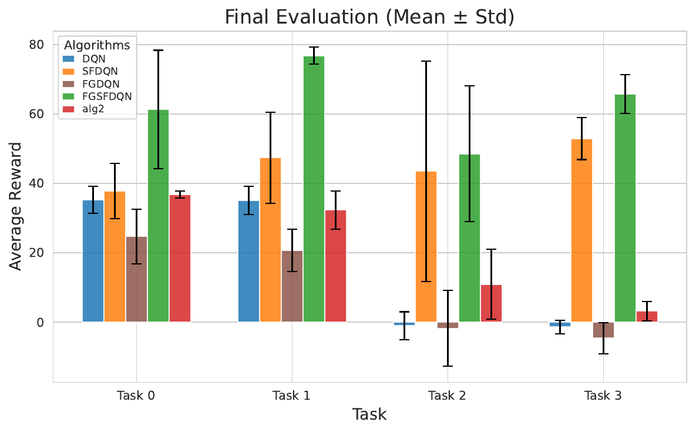
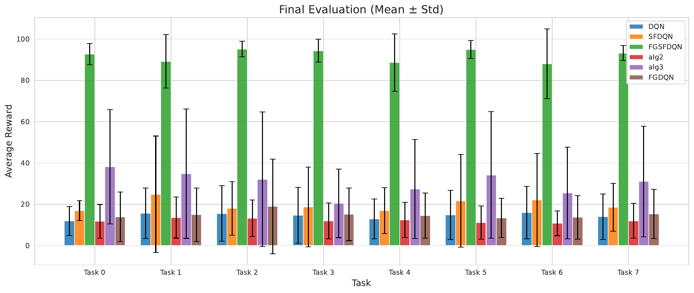
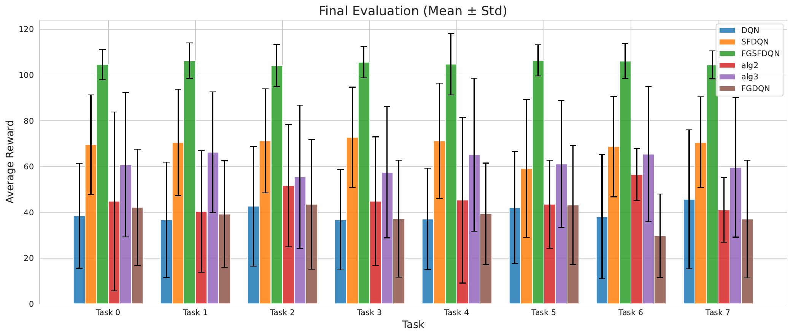
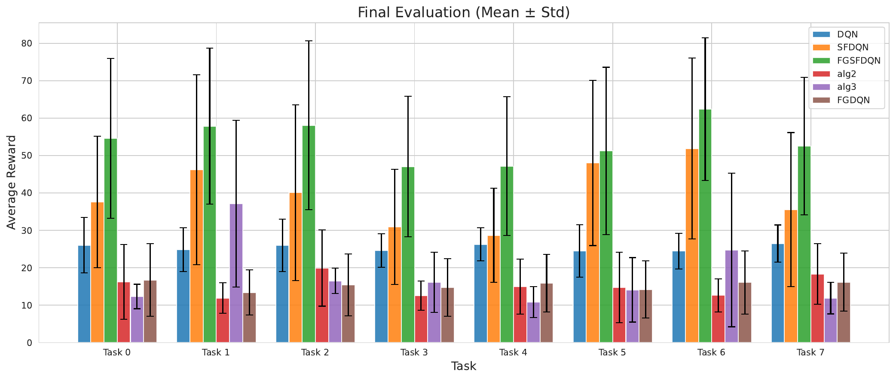

# Full-Gradient Successor Feature Representations

 **Supplementary Material:** [supplementary.pdf](supplementary.pdf)
 
 **Paper (arXiv):** https://arxiv.org/abs/2604.00686  


This repository contains the implementation of **FG-SFRQL**, a framework that extends **Successor Feature Representations (SFRQL)** by performing full-gradient minimization of the Bellman residual. The approach is designed to improve sample efficiency, training stability, and transfer performance.

We empirically compare:
- **DQN** (standard value-based baseline),
- **SFDQN** (semi-gradient successor feature representations),
- **FGDQN** (full-gradient DQN baseline), and
- **FG-SFDQN** (our proposed full-gradient variants),

across benchmark domains including:
- a discrete **4-Room GridWorld** with object-based rewards, and
- a continuous-control **Reacher** task implemented in PyBullet,
- a continuous-control **PointMaze** task (UMaze / Large).

---

## Installation

### Requirements

Install core dependencies:
```bash
pip install -r requirements.txt
```

### PyBullet Setup (for Reacher)

```bash
pip install pybullet
pip install "gym<0.26"

git clone https://github.com/benelot/pybullet-gym.git
cd pybullet-gym
pip install -e .
```

---

## Environments

### 4-Room GridWorld

* Discrete navigation with object collection.
* Tasks differ by reward vectors over object types.
* State encoding includes agent position and object memory.

### Reacher (PyBullet)

* Continuous robotic arm reaching task (discretized actions).
* Tasks differ by target positions.
* State includes joint angles, velocities, and relative target coordinates.

### PointMaze (Gymnasium Robotics)

* Continuous 2D navigation with sparse or dense reward variants.
* Tasks differ by goal-cell/goal-position choices.
* Supports transfer-style multi-task training with shared dynamics.

---

## Algorithms

### DQN

Standard Deep Q-Network trained independently per task, without transfer.

### SFDQN

Semi-gradient successor feature learning with Generalized Policy Improvement (GPI), following [Barreto et al](https://arxiv.org/abs/1606.05312) and [Reinke et al](https://arxiv.org/abs/2110.15701).

### FGDQN

Full-gradient DQN baseline that backpropagates through the bootstrap target for Bellman-residual minimization.

### FG-SFDQN (Ours)

Minimizes the full Mean Squared Bellman Error (MSBE) by differentiating through both the prediction and the bootstrap target.

Implemented variants:

* **Alg 1 (Sequential FG-SFDQN)**: The sequential implementation used in the experiments, where tasks are learned one after another. This is a direct modification of the standard SFRQL algorithm that incorporates full gradient updates.
* **Alg 2 (Randomized Tasks)**: introduces randomized task sampling. By drawing tasks from a distribution $\pi(i)$, it ensures that state-action-task triplets are visited according to a stationary distribution, satisfying the stationarity requirement of the mean-field analysis.
* **Alg 3 (Randomized + Averaging)**: extends Algorithm 2 by incorporating averaging over N next-state transitions.

---

## Results


Cumulative reward during training in Four-rooms environment.


Cumulative reward during training in Reacher environment.


Cumulative reward during training in PointMaze Large environment.


Cumulative reward during training in PointMaze Medium environment.


Cumulative reward during training in PointMaze U-Maze environment.


Final evaluation rewards in Four-Rooms environment.


Final evaluation rewards in Reacher environment.


Final evaluation rewards in PointMaze Large environment.


Final evaluation rewards in PointMaze Medium environment.


Final evaluation rewards in PointMaze U-Maze environment.

---

## Running Experiments

### Train

```bash
python train_parallel.py
```

### Evaluate

```bash
python evaluate_parallel.py
```

### Plot Results

```bash
python graph_results.py
```

# Citation
```bibtex
@misc{shrirao2026fullgradientsuccessorfeaturerepresentations,
      title={Full-Gradient Successor Feature Representations}, 
      author={Ritish Shrirao and Aditya Priyadarshi and Raghuram Bharadwaj Diddigi},
      year={2026},
      eprint={2604.00686},
      archivePrefix={arXiv},
      primaryClass={cs.LG},
      url={https://arxiv.org/abs/2604.00686}, 
}
